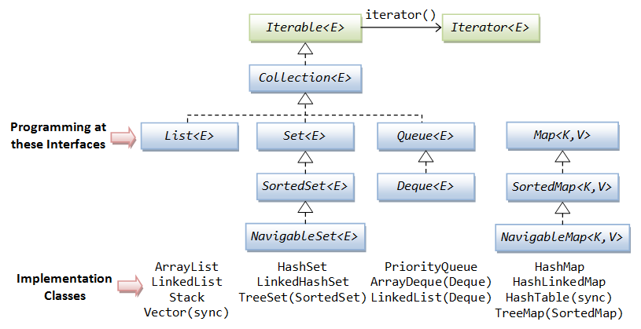

# Java-Collection-Tutorial
## Collection là gì?
Collection được hiểu là một nhóm các đối tượng được biểu diễn dưới dạng một đơn vị duy nhất (Ex: Danh sách điểm của sinh viên). Collection được sử dụng gần như trong mọi ngôn ngữ lập trình trong đó có Java.

## Java Collections Framework
Java 1.2 giới thiệu **Collections Framework** cung cấp một kiến trúc để lưu trữ và vận dụng nhóm các đối tượng. Mọi hoạt động với dữ liệu như tìm kiếm, sắp xếp, thêm, xoá vv... có thể được thực hiện bởi Java Collections.

Note: Map không extend Collection nhưng nó là Collection.

## Collection Interface

- [ArrayList](https://github.com/nguyenvantra/Java-Collection-Tutorial/blob/master/step1-arraylist.md)
- [Vector](https://github.com/nguyenvantra/Java-Collection-Tutorial/blob/master/step2-vector.md)
- [LinkedList](https://github.com/nguyenvantra/Java-Collection-Tutorial/blob/master/step3-linkedlist.md)
- [Stack](https://github.com/nguyenvantra/Java-Collection-Tutorial/blob/master/step4-stack.md)
- [HashSet](https://github.com/nguyenvantra/Java-Collection-Tutorial/blob/master/step5-hashset.md)

## Map Interface

## References
[1. http://www.geeksforgeeks.org/collections-in-java-2/](http://www.geeksforgeeks.org/collections-in-java-2/)

[2. https://www.javatpoint.com/collections-in-java](https://www.javatpoint.com/collections-in-java)
