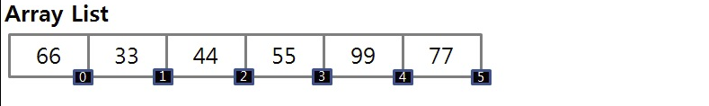

# LinkedList
LinkedList kế thừa **AbstractSequentialList class** và implements **List interface** và **Queue interface**. Cung cấp một cấu trúc dữ liệu **linked-list** (dạng danh sách được liên kết).
## LinkedList class declaration
Constructor | Description
------------ | -------------
```LinkedList()``` | Sử dụng khởi tạo một LinkedList rỗng
```LinkedList(Collection c)``` | Sử dụng khởi tạo LinkedList với các phần tử của Collection c

Example:
```java
// 1. LinkedList()
LinkedList list1 = new LinkedList();

// 2. LinkedList(Collection c)
ArrayList dummyList = new ArrayList(Arrays.asList("Alo", 2, "Darkness"));
LinkedList list2 = new LinkedList(dummyList);
```
## Method cơ bản trong LinkedList
### 1. boolean add(Object element)
Thêm phần tử được chỉ định vào cuối danh sách
```java
LinkedList list = new LinkedList();
list.add("Alo");
list.add(23);
System.out.println(list); // [Alo, 23]
```
### 2. void add(int index, Object element)
Thêm phần tử chỉ định vào vị trí chỉ định **index** vào danh sách.
```java
LinkedList list = new LinkedList();
list.add("Alo");
list.add(0, 2);
list.add(23);
System.out.println(list); // [2, Alo, 23]
```
### 3. void addFirst(Object element)
Thêm phần tử được chỉ định vào đầu danh sách.
```java
LinkedList list = new LinkedList();
list.add("Alo");
list.addFirst("Hello");
list.add(23);
System.out.println(list); // [Hello, Alo, 23]
```
### 4. void addLast(Object element)
Thêm phần tử được chỉ định vào cuối danh sách.
```java
LinkedList list = new LinkedList();
list.add("Alo");
list.add(23);
list.addLast("Hello");
System.out.println(list); // [Alo, 23, Hello]
```
### 5. boolean contains(Object element)
Trả về **true** nếu phần tử tồn tại trong danh sách.
```java
LinkedList list = new LinkedList();
list.add("Alo");
list.add(23);
list.contains("Alo"); // true
```
### 6. Object get(int index)
Trả về giá trị của phần tử tại vị trí **index** trong danh sách.
```java
LinkedList list = new LinkedList();
list.add("Alo");
list.add(23);
list.get(0); // Alo
```
### 7. Object remove(int index)
Xoá phần tử tại vị trí **index** trong danh sách.
```java
LinkedList list = new LinkedList();
list.add("Alo");
list.add(23);
System.out.println(list); // [Alo, 23]
list.remove(0);
System.out.println(list); // [23]
```
### 8. int size()
Trả về kích thước hiện tại của danh sách.
```java
LinkedList list = new LinkedList();
list.add("Alo");
list.add(23);
list.size(); // 2
```
### 9. void clear()
Xoá bỏ tất cả các phần tử trong danh sách.

Đây chỉ là những method cơ bản của LinkedList để biết thêm truy cập [docs](https://docs.oracle.com/javase/7/docs/api/java/util/LinkedList.html)

## Sự khác biệt LinkedList và ArrayList
### Data Structure
- **LinkedList**: Cấu trúc dữ liệu của LinkedList bao gồm các **node**. Nó cung cấp cho chúng ta **double linked-list** trong Java. Tuy nhiên LinkedList chỉ lưu địa chỉ của node đầu tiên **(head)** và node cuối cùng **(tail)**. Head sẽ được 1 liên kết null chỉ đến và 1 liên kết chỉ đến các node tiếp theo. Các node tiếp theo cũng sẽ có 1 liên kết chỉ đến node kề trước và node tiếp theo, cứ như vậy đến tail. **Tail** cũng sẽ có 1 liên kết chỉ đến node kề phía trước và 1 liên kết chỉ đến null (để xác định node cuối cùng). Các node này sẽ chiếm giữ các ô nhớ không liên tục trên bộ nhớ.


- **ArrayList**: Cấu trúc lưu trữ của ArrayList là gồm các phần tử chiếm giữ các địa chỉ liên tục trong bộ nhớ. Nó cung cấp cho chúng ta **dynamic arrays** trong Java.




